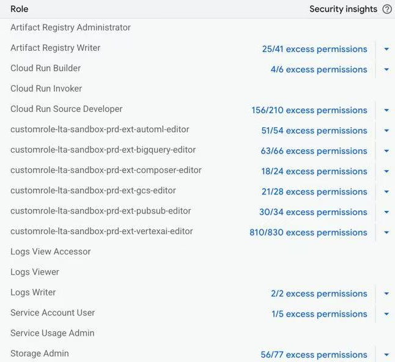

# Step-by-Step Deployment Guide

This guide provides a detailed, step-by-step workflow for deploying a remote agent to Google Cloud Platform (GCP) using Cloud Run. This approach packages the agent as a container and runs it as a scalable, serverless HTTP service. 

## Prerequisites

### Before you begin, ensure you have the following installed and configured:

*   **Python 3.13 or higher**
*   **[UV](https://docs.astral.sh/uv/)**: The Python package installer and virtual environment manager.
*   **[Docker](https://docs.docker.com/get-docker/)**: To build and test container images locally.
*   **[Google Cloud SDK](https://cloud.google.com/sdk/docs/install)**: To interact with your GCP project from the command line.
*   **A Google Cloud Platform (GCP) Project**: If you don't have one, create one in the [GCP Console](https://console.cloud.google.com/).
*   **A Gemini API Key**: Obtain a key from [Google AI Studio](https://aistudio.google.com/app/apikey).

### Properly configured permissions are critical for security.

1.  **Your Permissions (or CI/CD pipeline):** To build and deploy, your user account or service account needs:

    

---

## Part 1: Deploying the Remote Agents to Google Cloud Run

This part covers deploying the `weather_agent` and `airbnb_agent` as serverless applications on Google Cloud Run.

### Step 1: Configure Remote Agent Environment Files

Before deploying, you must configure the environment variables for each remote agent.

1.  **Navigate to the `airbnb_agent` directory:**
    ```bash
    cd airbnb_planner_multiagent/airbnb_agent
    ```
2.  **Create and configure the `.env` file:** 
    Copy the contents of `.env.example` to a new file named `.env` and add your `GOOGLE_API_KEY`.

### Step 2: Build the Container Images

For each remote agent, you will build a Docker image and push it to the Google Artifact Registry.

1.  **Navigate to the agent's directory:**
    ```bash
    cd airbnb_planner_multiagent/airbnb_agent
    ```
2.  **(Optional) Test the build locally:**
    ```bash
    docker build -t airbnb_agent .
    ```

3. **Example `gcloud builds submit` command:**
    You can build your container image using GCP's Cloud Build service. This command packages your code from a specified source directory, sends it to Cloud Build, which builds the image and pushes it to your Artifact Registry.
    ```bash
    gcloud builds submit [SOURCE_DIRECTORY] --tag [REGION]-docker.pkg.dev/[PROJECT_ID]/[REPOSITORY_NAME]/[IMAGE_NAME]:[TAG]
    ```

    **Based on the provided example:**
    ```bash
    gcloud builds submit airbnb_planner_multiagent/airbnb_agent 
    --tag asia-southeast1-docker.pkg.dev/prj-lta-sandbox-prd-ext-00123/airbnb-agent-repo/airbnb-agent
    ```

### Step 3: Deploy the Images to Cloud Run

Now, deploy the container images as services on Cloud Run.

1.  **(Optional) Test the deployed service locally:**
    ```bash
    docker run -p 8080:8080 airbnb-agent
    ```
    
2.  **Deploy the service:**
    **Example `gcloud run deploy` command:**
    ```bash
    gcloud run deploy [SERVICE_NAME] 
    --image=[REGION]-docker.pkg.dev/[PROJECT_ID]/[REPOSITORY_NAME]/[IMAGE_NAME]:[TAG]
    --memory [MEMORY_SIZE]
    --region=[REGION]
    --platform=managed
    ```

    **Based on the provided example:**
    ```bash
    gcloud run deploy airbnb-agent \
    --image=asia-southeast1-docker.pkg.dev/prj-lta-sandbox-prd-ext-00123/airbnb-agent-repo/airbnb-agent:latest \
    --memory 1Gi \
    --region=asia-southeast1 \
    --platform=managed
    
3.  **Take note of the service URL** provided in the output. You will need it for the host agent's configuration.

### Step 4: Repeat step 1 to 3 for weather agent

---

## Part 2: Configuring and Running the Local Host Agent

After deploying the remote agents, you can run the `host_agent` locally to interact with them.

### Step 1: Set Up the Virtual Environment

1.  **Navigate to the project root directory:**
    ```bash
    cd /path/to/A2A_Cloud_Deployment
    ```
2.  **Create and activate the virtual environment:**
    ```bash
    uv venv
    source .venv/bin/activate  # On Windows, use `.venv\Scripts\activate`
    ```

### Step 2: Configure the Host Agent Environment File

1.  **Navigate to the `host_agent` directory:**
    ```bash
    cd airbnb_planner_multiagent/host_agent
    ```
2.  **Create and configure the `.env` file:**
    *   Set `AIR_AGENT_URL` to the service URL of your deployed `airbnb-agent-service`.
    *   Set `WEA_AGENT_URL` to the service URL of your deployed `weather-agent-service`.
    *   Add your `GOOGLE_API_KEY`.

### Step 3: Run the Host Agent

1.  **Navigate to the `host_agent` directory:**
    ```bash
    cd airbnb_planner_multiagent/host_agent
    ```
2.  **Run the host agent:**
    ```bash
    uv run .
    ```
    if the packages are not installed properly, consider manual installation using uv at project root
    ```bash
    uv pip install -r pyproject.toml
    ```

You can now interact with the host agent, which will delegate tasks to your remote agents running on Google Cloud Run.

---

## Post-Deployment: Operations and Troubleshooting

### 1. Authenticating and Communicating with the Deployed Agent

Once deployed, your Cloud Run service is private by default and requires authentication. Here are the primary methods for a client to authenticate its requests.

#### Method 1: No Authentication (Testing Only)

During deployment, you can add the `--allow-unauthenticated` flag.

```bash
gcloud run deploy my-agent-service --image ... --allow-unauthenticated
```

This makes the service public and accessible without any authentication. While useful for initial testing, **this is not recommended for production environments** as it exposes your agent to anyone on the internet.

---

#### Method 2: Programmatic Authentication via Service Account (Production)

This is the **recommended and most secure method** for service-to-service communication (e.g., another cloud function or a VM calling your agent). The client application uses a service account to programmatically generate an identity token.

1.  **Install the library:**
    ```bash
    pip install google-auth
    ```

2.  **Use the library to get a token:** The client code fetches an identity token, specifying the URL of the Cloud Run service as the `audience`.

    **Example in Python:**
    ```python
    import google.auth
    import google.auth.transport.requests
    import requests

    def get_auth_token(service_url):
        """Fetches a Google-signed identity token."""
        auth_req = google.auth.transport.requests.Request()
        # The credentials will be automatically discovered from the environment
        # (e.g., the service account attached to a VM or another Cloud Run service).
        credentials, project = google.auth.default()
        
        # The audience must be the URL of the receiving Cloud Run service.
        id_token = google.auth.jwt.encode(auth_req, credentials, audience=service_url)
        return id_token

    def call_agent(service_url, payload):
        """Calls the agent service with an authenticated request."""
        token = get_auth_token(service_url)
        headers = {
            "Authorization": f"Bearer {token}",
            "Content-Type": "application/json"
        }
        response = requests.post(f"{service_url}/your-endpoint", headers=headers, json=payload)
        return response.text
    ```

---

#### Method 3: Host Agent Connection and Manual Testing

This method covers two related scenarios: the primary approach of a host agent connecting to the remote agent, and a manual approach for debugging.

**1. Connecting from a Host Agent (Primary Method)**

The intended way to interact with the remote agent is via a host agent. The host is responsible for generating a fresh identity token for each session and managing the communication. The Airbnb sample agent demonstrates this pattern.

**Example token generation in Python (from `routing_agent.py`):**
This function uses the `gcloud` CLI to generate an identity token. The environment running this code must be authenticated with GCP.

```python
import subprocess

def get_identity_token_from_gcloud() -> str:
    try:
        # Note: On Windows, the command is "gcloud.cmd". On Linux/macOS, it's "gcloud".
        result = subprocess.run(
            ["gcloud.cmd", "auth", "print-identity-token"],
            capture_output=True,
            text=True,
            check=True
        )
        return result.stdout.strip()
    except subprocess.CalledProcessError as e:
        if "Reauthentication failed" in e.stderr:
            raise RuntimeError(
                "GCloud authentication has expired or failed. Please run `gcloud auth login` manually to reauthenticate."
            )
        else:
            raise RuntimeError(
                f"Failed to get identity token: {e.stderr.strip()}"
            )
    except FileNotFoundError:
        print("gcloud command not found. Check PATH or use full path.")
        raise
```

**2. Connecting with `curl` (Debugging Alternative)**

To debug the remote agent in isolation, you can manually send it requests using `curl`.

-   **Get the Service URL:** You need the remote agent's public URL to send a request to it.
    ```bash
    export SERVICE_URL=$(gcloud run describe [SERVICE_NAME] --platform managed --region [REGION] --format 'value(status.url)')
    ```

-   **Generate an Identity Token:**
    ```bash
    export AUTH_TOKEN=$(gcloud auth print-identity-token)
    ```

-   **Call the Agent with `curl`:** Use the URL and token to send a direct HTTP request.
    ```bash
    curl -X POST "${SERVICE_URL}/your-endpoint" \
    -H "Authorization: Bearer ${AUTH_TOKEN}" \
    -H "Content-Type: application/json" \
    -d '{"key": "value"}'
    ```

### 2. Managing State with a Task Store

Agents often need to track the state of long-running tasks. This requires a persistent storage layer, known as a Task Store.

#### The Challenge: Statelessness in Cloud Run

Cloud Run is a serverless platform, which means container instances are ephemeral. They can be started, stopped, and scaled automatically by Google. Any data stored in the container's memory will be lost when an instance shuts down. This stateless nature presents a challenge for tracking tasks across multiple requests or over long periods.

#### The Limitations of `InMemoryTaskStore`

The Google Agent Development Kit (ADK) provides an `InMemoryTaskStore`, which is excellent for getting started quickly and for local testing. It works by storing all task information in the local memory of the running container.

While this is effective for a single, continuous session, it has a critical limitation in a stateless environment like Cloud Run: it does not persist memory across different sessions or container restarts. If a Cloud Run instance handling a task is shut down or replaced, the task's state is permanently lost. A new instance will have no knowledge of the previous one, making it impossible to continue long-running tasks.

For this reason, while `InMemoryTaskStore` is functional for development, a more robust, persistent task store is necessary for production environments to ensure reliability and statefulness.

#### Production-Grade Solutions: Cloud SQL and AlloyDB

For a robust, scalable, and reliable production environment, you should use a dedicated, managed database service. This externalizes the state from your Cloud Run instances, allowing any instance to read and write from a central, persistent data store.

-   **Google Cloud SQL:** A fully managed relational database service for MySQL, PostgreSQL, and SQL Server. It's a highly reliable and scalable option for managing your agent's tasks.
-   **Google AlloyDB for PostgreSQL:** A fully managed, PostgreSQL-compatible database service designed for the most demanding transactional and analytical workloads, offering superior performance, availability, and scale.

### 3. Troubleshooting: `taskId` Handling on Initial Request

A common issue when connecting a host agent to a remote agent server involves the creation and management of the `taskId`.

#### The Problem: Client-Generated `taskId` on First Request

In some examples, the host agent (the client) is shown to generate a new `taskId` if one doesn't already exist for a conversation.

**Original (problematic) host agent logic:**
```python
# From a2a-samples/samples/python/agents/airbnb_planner_multiagent/host_agent/routing_agent.py
def get_or_create_task_id(self) -> str:
    if not self._task_id:
        self._task_id = str(uuid.uuid4())
    return self._task_id
```
The host agent would then send this newly generated `taskId` in the first request to the remote server. However, the A2A Python library's `DefaultRequestHandler` on the server is designed to reject this.

The server-side handler expects that if a `taskId` is provided in a request, a corresponding task *must* already exist in its task store. Since this is the first request, no such task exists, and the handler raises an error.

**Server-side `DefaultRequestHandler` logic that causes the error:**
```python
# From a2a-python/src/a2a/server/request_handlers/default_request_handler.py
async def handle(self, ..., task_id: str | None = None, ...):
    if task_id:
        task = self._task_store.get(task_id)
        if not task:
            # This error is triggered because the client sent a new, unknown taskId
            raise ValueError(f"Task with id {task_id} not found")
    else:
        # This is the path that should be taken on the first request
        task = self._task_store.create()
    ...
```

#### The Solution: Server-Side `taskId` Generation

The correct workflow is to let the server generate the `taskId` on the first request.

1.  **Initial Request:** For the first message in a conversation, the `host_agent` sends the request with `taskId` set to `None`. 
2.  **Server Response:** The remote agent's `DefaultRequestHandler` receives this request, sees that the `taskId` is missing, and creates a new task, generating a unique `taskId`. This new ID is included in the response sent back to the host.
3.  **Subsequent Requests:** The `host_agent` saves this `taskId` and includes it in all subsequent messages for that conversation, ensuring the remote agent can retrieve the correct context.
4.  **Task Completion:** Once a task is finished (e.g., the user's request is fully answered), the `host_agent`'s logic resets the `taskId` to `None` for the next interaction with that agent. This ensures that a new, unrelated request starts a fresh task instead of incorrectly reusing a completed one.    

By ensuring the `taskId` is `None` for the first request, you align with the server's expected behavior and ensure a new task is created correctly.

### 4. Using Vertex AI

Instead of using a Gemini API key, you can configure the agents to use Vertex AI for generative AI capabilities. This is the recommended approach for production environments.

**To enable Vertex AI, configure the `.env` file for each agent as follows:**

1.  Set `GOOGLE_GENAI_USE_VERTEXAI` to `TRUE`.
2.  Add your GCP `PROJECT_ID` and `REGION`:
    ```
    GCP_PROJECT_ID=your-gcp-project-id
    GCP_REGION=your-gcp-region
    ```
3.  Ensure the service account for your Cloud Run service has the `Vertex AI User` role.

### 5. Logging and Monitoring

Once your agent is deployed, it's crucial to monitor its behavior and access its logs for debugging.

-   **Viewing Logs:** All output from your agent (from `print` statements or the `logging` library) is automatically captured by Google Cloud's operations suite. You can view these logs in near real-time:
    1.  Go to the **Google Cloud Console**.
    2.  Navigate to **Cloud Run** and select your service (`my-agent-service`).
    3.  Click the **"Logs"** tab.
    4.  You can filter logs by severity (e.g., `ERROR`, `INFO`) and search for specific text.

-   **Monitoring Metrics:** The Cloud Run dashboard provides essential performance metrics:
    1.  In your service's page, click the **"Metrics"** tab.
    2.  Here you can monitor **Request Count**, **Request Latency**, **Container CPU Utilization**, and **Container Memory Utilization**.
    3.  You can set up alerts based on these metrics to be notified of potential issues (e.g., a spike in errors or high CPU usage).